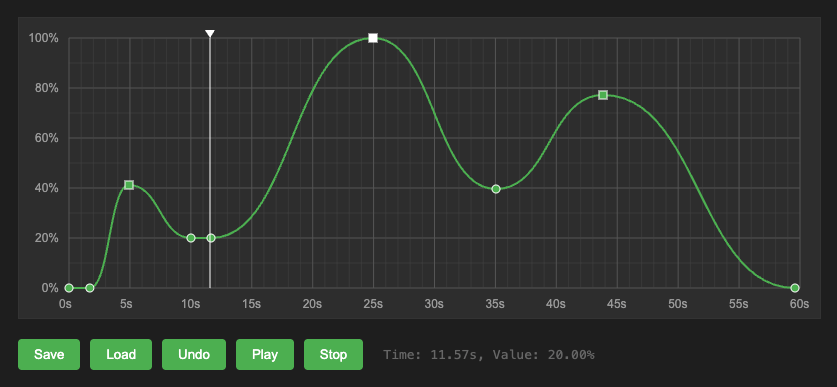

# timeline.js Timeline Editor

A JavaScript-based timeline editor component that provides an interactive interface for creating and editing animation curves. The editor supports both linear and bezier interpolation, with a playback system for previewing animations. 



## Features

- Interactive curve editing with draggable control points
- Support for both linear and bezier interpolation
- Zoomable and pannable timeline view
- Playback controls (play, pause, stop, seek)
- Marker system for marking specific points in the timeline
- Undo functionality
- Export/Import curve data and markers
- Customizable appearance and duration

## Basic Usage

1. To use the TimelineEditor, you need to include the timeline.js file in your project. 

2. Include the TimelineEditor in your HTML file: 
```javascript
<canvas id="timelineCanvas"></canvas>
<script src="timeline.js"></script>
```
3. Use the TimelineEditor in your JavaScript code:
```javascript
// Initialize the editor
const timeline = new TimelineEditor('timelineCanvas');

// Add event listener for value changes
timeline.addEventListener('playheadTimeChange', (data) => {
    console.log(`Time: ${data.time}s, Value: ${data.value}%`);
});

// Start playback
timeline.play();
```

## Customization
You can customize the appearance of the TimelineEditor by passing options to the constructor: 
```javascript
const timeline = new TimelineEditor('timelineCanvas', {
    totalDuration:       120,   // Total duration of the timeline in seconds
    viewportDuration:    30,    // Duration of the visible viewport in seconds
    minViewportDuration: 10,    // Minimum viewport range in seconds
    maxViewportDuration: 90,    // Maximum viewport range in seconds
    lineColor:           '#c00' // Color of the lines / curves in the timeline view
})
```

## Mouse Interactions
- Left click: Add a polyline control point
- Right click: Add a bezier control point
- Drag control point: Move the control point
- Double click control point: Delete the control point
- Double click marker: Remove the marker
- Drag empty area: Pan viewport
- Mouse wheel: Zoom in/out
- Click the bottom or top area of ​​the timeline: Jump the playhead to the position
- Drag playhead indicator: Scrub through timeline


## API Reference

### Properties
- `totalDuration`: Total duration of the timeline in seconds
- `viewportDuration`: Duration of the visible viewport in seconds
- `minViewportDuration`: Minimum viewport range in seconds
- `maxViewportDuration`: Maximum viewport range in seconds
- `lineColor`: Color of the lines / curves in the timeline view
- `points`: Array of control points
- `markers`: Array of marker positions
- `playhead.time`: Current time position of the playhead in seconds
- `playhead.isPlaying`: Whether playback is active (read-only)

### Methods

#### Playback Control
- `play()`: Start playback
- `pause()`: Pause playback
- `stop()`: Stop and reset playhead
- `seek(time)`: Jump to specific time (in seconds)
- `draw()`: Redraw the timeline view (need to call after modifying properties)

#### Data Management
- `exportData()`: Export curve data
- `importData(data)`: Import curve data
- `undo()`: Revert last change
- `getValue(time)`: Get interpolated value at time (in seconds)

#### Marker Management
- `addMarker(time)`: Add a marker at time (in seconds)
- `clearMarkers()`: Remove all markers
- `exportMarkers()`: Export marker data
- `importMarkers(data)`: Import marker data

#### Event Handling
- `addEventListener(eventName, callback)`: Add event listener
- `removeEventListener(eventName, callback)`: Remove event listener

### Events
- `playheadTimeChange`: Fired when playhead time position changes
```javascript
timeline.addEventListener('playheadTimeChange', (data) => {
    console.log(`Time: ${data.time}s, Value: ${data.value}%`);
});
```
### Example
```javascript
// Create a simple animation curve
const timeline = new TimelineEditor('timelineCanvas');

// Set timeline properties
timeline.totalDuration = 90;
timeline.viewportDuration = 30;
timeline.lineColor = '#0cf';

// Import predefined curve
timeline.importData({
    points: [
        { time:  0, value: 0 }, // default point type is TimelineEditor.PointType.POLYLINE
        { time:  5, value: 0 },
        { time: 15, value: 100, type: TimelineEditor.PointType.BEZIER },
        { time: 30, value: 0 }
    ]
});

// Add some markers
timeline.addMarker(10);  // Add marker at 10s
timeline.addMarker(20);  // Add marker at 20s

// Monitor value changes
timeline.addEventListener('playheadTimeChange', (data) => {
    console.log(`Time: ${data.time}s, Value: ${data.value}%`);
});

```
You can also find an example of how to use the TimelineEditor in the index.html and app.js files. 

## Qt / QML Usage
The TimelineEditor can also be used in Qt / QML projects. To use the TimelineEditor in QML, you need to include the timeline.qml file in your Qt project. A simple example of how to use the TimelineEditor in QML is provided in the _qt_ directory. 

## Acknowledgments
This project was co-created by AI and me. Much thanks with love to everyone who contributed to the AI development. I am using Trae IDE with Claude LLM to help me write the code and this README file. 

## License
This project is licensed under the Apache 2.0 License. See the LICENSE file for details. 
